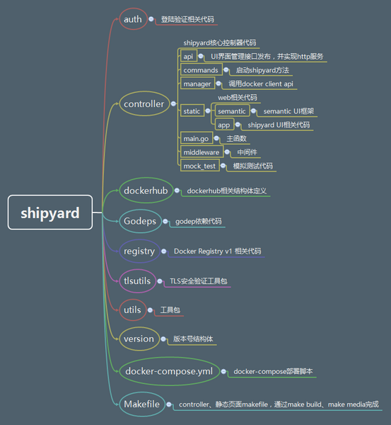
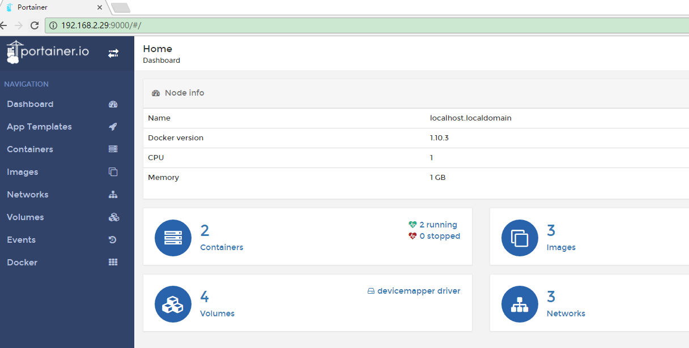

### Docker部署
#### Docker

- step 1: 安装必要的一些系统工具
```
yum install -y yum-utils device-mapper-persistent-data lvm2 
```
- Step 2: 添加软件源信息
```
yum-config-manager --add-repo http://mirrors.aliyun.com/docker-ce/linux/centos/docker-ce.repo
```
- Step 3: 更新并安装 Docker-CE 
```
yum makecache fast sudo yum -y install docker-ce
```
- Step 4: 开启Docker服务
```
service docker start
```
#### 注意： 
###### 官方软件源默认启用了最新的软件，您可以通过编辑软件源的方式获取各个版本的软件包。例如官方并没有将测试版本的软件源置为可用，你可以通过以下方式开启。同理可以开启各种测试版本等。
```
vim /etc/yum.repos.d/docker-ce.repo 
# 将 [docker-ce-test] 下方的 enabled=0 修改为 enabled=1
## 安装指定版本的Docker-CE:
# Step 1: 查找Docker-CE的版本:
yum list docker-ce.x86_64 --showduplicates | sort -r
# Loading mirror speeds from cached hostfile# Loaded plugins: branch, fastestmirror, langpacks
# docker-ce.x86_64 17.03.1.ce-1.el7.centos docker-ce-stable
# docker-ce.x86_64 17.03.1.ce-1.el7.centos @docker-ce-stable
# docker-ce.x86_64 17.03.0.ce-1.el7.centos docker-ce-stable
# Available Packages
# Step2 : 安装指定版本的Docker-CE: (VERSION 例如上面的 17.03.0.ce.1-1.el7.centos)
yum -y install docker-ce-[VERSION]
```

#### 修改镜像源：
###### 注册阿里云账户，获取加速地址，修改以下配置文件，重启docker
```
mkdir -p /etc/docker
tee /etc/docker/daemon.json <<-'EOF'
{
  "registry-mirrors": ["https://0i9pgqp7.mirror.aliyuncs.com"]
}
EOF
systemctl daemon-reload
systemctl restart docker

##或 追加配置到ExecStart后面
cat /usr/lib/systemd/system/docker.service  
ExecStart=/usr/bin/dockerd --registry-mirror=https://0i9pgqp7.mirror.aliyuncs.com

ps -ef |grep docker
root      45187      1  0 00:46 ?        00:01:30 /usr/bin/dockerd --registry-mirror=https://0i9pgqp7.mirror.aliyuncs.com

##### 启动：

systemctl start docker
```

##### 常用命令：
```
#查看镜像:
docker search

#从官方镜像仓库下载centos：
docker pull centos

#列出本机镜像：
docker images

#查看刚运行过的容器
docker ps –l
```

#### 安装 compose
```
curl -L https://github.com/docker/compose/releases/download/1.19.0/docker-compose-`uname -s`-`uname -m` -o /usr/local/bin/docker-compose
chmod +x /usr/local/bin/docker-compose 
ll -h /usr/local/bin/docker-compose 
docker-compose --version

mkdir /data/docker-file -p
cd /data/docker-file
vim  
```

##### 使用 Compose 基本会有如下三步流程：

- 在 Dockfile 中定义你的应用环境，使其可以在任何地方复制。
- 在 docker-compose.yml 中定义组成应用程序的服务，以便它们可以在隔离的环境中一起运行。
- 最后，运行dcoker-compose up，Compose 将启动并运行整个应用程序。

##### 启动容器：
- docker run命令首先会从特定的image创之上create一层可写的Container，然后通过start命令来启动它。停止的container可以重新启动并保留原来的修改。
 
##### 使用image创建container并进入交互模式, login shell是/bin/bash
```
docker run -it --name mytest centos:centos6 /bin/bash
```

##### 运行一个container放到后台运行
```
docker run –d --name mytest centos:centos6 /bin/bash
```

##### 映射host到container的端口和目录
```
docker run -d --name=myt2 -p 172.16.1.99:50718:22 centos:centos6 /bin/bash
```

##### 连接到正在运行中的container（attach）带上--sig-proxy=false来确保CTRL-D或CTRL-C不会关闭容器
```
docker attach --sig-proxy=false $CONTAINER_ID
docker exec -it 245394dd414c /bin/bash
```
##### 如何退出容器而不停止容器？组合键：Ctrl+P+Q

##### 自动重启容器
```
docker run --restart=always --name my_container -d ubuntu /bin/bash

--restart 标志会检查容器的退出代码，并据此来决定是否要重启容器，默认是不会重启。

--restart的参数说明

always：无论容器的退出代码是什么，Docker都会自动重启该容器。

on-failure：只有当容器的退出代码为非0值的时候才会自动重启。另外，该参数还接受一个可选的重启次数参数，`--restart=on-fialure:5`表示当容器退出代码为非0时，Docker会尝试自动重启该容器，最多5次。

#开启/停止/重启container（start/stop/restart）

容器可以通过run新建一个来运行，也可以重新start已经停止的container，但start不能够再指定容器启动时运行的指令，因为docker只能有一个前台进程。容器stop（或Ctrl+D）时，会在保存当前容器的状态之后退出，下次start时保有上次关闭时更改。而且每次进入attach进去的界面是一样的，与第一次run启动或commit提交的时刻相同。

CONTAINER_ID=$(docker start <containner_id>)
docker stop $CONTAINER_ID
docker restart $CONTAINER_ID
```

#### 删除本地镜像:
```
如果要删除本地的镜像，可以使用 docker rmi 命令，其格式为：
docker rmi [OPTIONS] IMAGE [IMAGE...]
OPTIONS说明：
-f :强制删除；
--no-prune :不移除该镜像的过程镜像，默认移除；
docker rmi [OPTIONS] IMAGE [IMAGE...]
OPTIONS说明：
-f :强制删除；
--no-prune :不移除该镜像的过程镜像，默认移除；
例子：
root@runoob:~# docker rmi -f runoob/ubuntu:v4
Untagged: runoob/ubuntu:v4
Deleted: sha256:1c06aa18edee44230f93a90a7d88139235de12cd4c089d41eed8419b503072be
Deleted: sha256:85feb446e89a28d58ee7d80ea5ce367eebb7cec70f0ec18aa4faa874cbd97c73

注意 docker rm 命令是删除容器，不要混淆。

docker commit :从容器创建一个新的镜像。语法：
docker commit [OPTIONS] CONTAINER [REPOSITORY[:TAG]]

OPTIONS说明：
-a :提交的镜像作者；
-c :使用Dockerfile指令来创建镜像；
-m :提交时的说明文字；
-p :在commit时，将容器暂停。

实例：将容器a404c6c174a2 保存为新的镜像,并添加提交人信息和说明信息。
runoob@runoob:~$ docker commit -a "runoob.com" -m "my apache" a404c6c174a2  mymysql:v1 
sha256:37af1236adef1544e8886be23010b66577647a40bc02c0885a6600b33ee28057
runoob@runoob:~$ docker images mymysql:v1
REPOSITORY          TAG                 IMAGE ID            CREATED             SIZE
mymysql             v1                  37af1236adef        15 seconds ago      329 MB
```

##### 给镜像打上标签（tag）
```
- tag的作用主要有两点：一是为镜像起一个容易理解的名字，二是可以通过docker tag来重新指定镜像的仓库，这样在push时自动提交到仓库。将同一IMAGE_ID的所有tag，合并为一个新的
docker tag 195eb90b5349 seanlook/ubuntu:rm_test

- 新建一个tag，保留旧的那条记录
# docker tag Registry/Repos:Tag New_Registry/New_Repos:New_Tag

启动命令
docker run -d --name=wiklub -p 172.16.1.39:50718:22 -p 172.16.1.39:80:80 -p 172.16.1.39:6090:6090 -p 172.16.1.39:9090:9090 -p 172.16.1.39:7090:7090 -v /etc/localtime:/etc/localtime:ro -v /docker/wiklub/home/wiklub:/home/wiklub -v /docker/wiklub/hosts:/etc/hosts wiklub:v2 /usr/sbin/sshd -D
```

#### 私有仓库
##### 容器运行
```
#在安装了 Docker 后，可以通过获取官方 registry 镜像来运行。
docker run -d -p 5000:5000 registry

#修改配置文件
cat /etc/docker/daemon.json
  { "insecure-registries":["172.16.1.189:5000","172.16.1.99:5000"] }

#上传镜像到私有容器：
docker tag wiklub:st2 172.16.1.99:5000/wiklub:st2
[root@docker-02 ~]# docker push 172.16.1.99:5000/wiklub:st2
```

##### dockerfile
```
cat Dockerfile
FROM centos:centos6.6
MAINTAINER wuqi
RUN yum install -y gcc lrzsz vim ntp tar telnet wget \
&& mkdir -p /application/tools/ /server/scripts/

COPY *tar.gz /application/tools/
COPY *sh /server/scripts/

RUN /server/scripts/add_user.sh \
&& /server/scripts/auto_install_apache.sh \
&& /server/scripts/auto_install_resin.sh \
&& /server/scripts/auto_install_php.sh \
&& rm -rf /application/tools/
docker build –t docker build -t mould:larp-v1 .
```

##### 限制内存：
- 默认docker内存限制可以使用-m参数进行限制，但如果仅-m参数，不添加其他，那么内存限制不会限制死，比如你-m 256m内存，那么容器里程序可以跑到256m*2=512m后才会被oom给杀死，
- 原因是源码里memory.memsw.limit_in_bytes 值是被设置成我们指定的内存参数的两倍。
```
-m 100m --memory-swap=100m
```

##### 网络
```
git clone https://github.com/jpetazzo/pipework

cp ~/pipework/pipework /usr/local/bin/

pipework  em1 -i eth0 容器名 172.16.1.55/24@172.16.1.248

/etc/security/limits.conf
```

##### 安装shipyard图形化管理工具
```
curl -s https://shipyard-project.com/deploy | bash -s
http://172.16.1.99:8080
Username: admin Password: shipyard

安装 shipyard 从节点(IP是主的)
curl -sSL https://shipyard-project.com/deploy | ACTION=node DISCOVERY=etcd://172.16.1.99:4001 bash -s

删除shipyard
curl -s https://shipyard-project.com/deploy | ACTION=remove bash -s

shipyard 不能识别centos6 docker-io 1.7
```
##### shipyard问题
```
- 访问shipyard管理界面时候打不开？
由于采用了rethinkdb数据库，数据库未准备好之前是不能打开的，需要等大约1分钟。

- shipyard能打开，但是没有容器和镜像？
需要设置防火墙或关闭防火墙。
  firewall-cmd --zone=public --permanent --add-port=2375/tcp
  firewall-cmd --reload

- 在shipyard中找不到某些docker节点？
可能由于访问discovery.hub.docker.com的网络不稳定原因（超时），尝试重启swarm agent容器。

ERRO[0011] Post https://discovery.hub.docker.com/v1/clusters/3c739bd3a589da0788978f502ea318ea?ttl=180: net/http: TLS handshake timeout
需要设置防火墙或关闭防火墙。
```



#### Portainer轻量级web管理工具
##### 安装 portainer
```
docker run -d -p 9000:9000 -v /var/run/docker.sock:/var/run/docker.sock portainer/portainer
```


### docker 集群
#### 启动swarm集群
```
docker swarm init --advertise-addr 172.16.1.188
Swarm initialized: current node (qu8q04683ue9b45fmuwhx6f1d) is now a manager.

To add a worker to this swarm, run the following command:

    docker swarm join \
    --token SWMTKN-1-1e43zu0rvyyo5d4qt99efaik6j1j5cfj0nes94jb0t3pygjxeb-aotslv3cfdth3pjqz10jfeo25 \
    172.16.1.99:2377

To add a manager to this swarm, run 'docker swarm join-token manager' and follow the instructions.
```

#### 加入新机器到集群
- 在docker swarm init 完了之后，会提示如何加入新机器到集群，如果当时没有注意到，也可以通过下面的命令来获知 如何加入新机器到集群。
```
docker swarm join-token worker
To add a worker to this swarm, run the following command:

    docker swarm join \
    --token SWMTKN-1-1e43zu0rvyyo5d4qt99efaik6j1j5cfj0nes94jb0t3pygjxeb-aotslv3cfdth3pjqz10jfeo25 \
    172.16.1.99:2377
在worker节点执行：
docker swarm join \
    --token SWMTKN-1-1e43zu0rvyyo5d4qt99efaik6j1j5cfj0nes94jb0t3pygjxeb-aotslv3cfdth3pjqz10jfeo25 \
    172.16.1.99:2377

执行docker node ls
ID                           HOSTNAME   STATUS  AVAILABILITY  MANAGER STATUS
fium73eynh73isiwbp1f3q2b1    docker-01  Ready   Active        
qu8q04683ue9b45fmuwhx6f1d *  docker-02  Ready   Active        Leader
```

##### 退出集群：
```
docker swarm leave -f
```

##### 更改节点的availablity状态
- swarm集群中node的availability状态可以为 active或者drain。其中active状态下，node可以接受来自manager节点的任务分派；而drain状态下，node节点会结束task，且不再接受来自manager节点的任务分派。
```
docker node update --availability drain worker1
docker node update --availability active worker1
```


