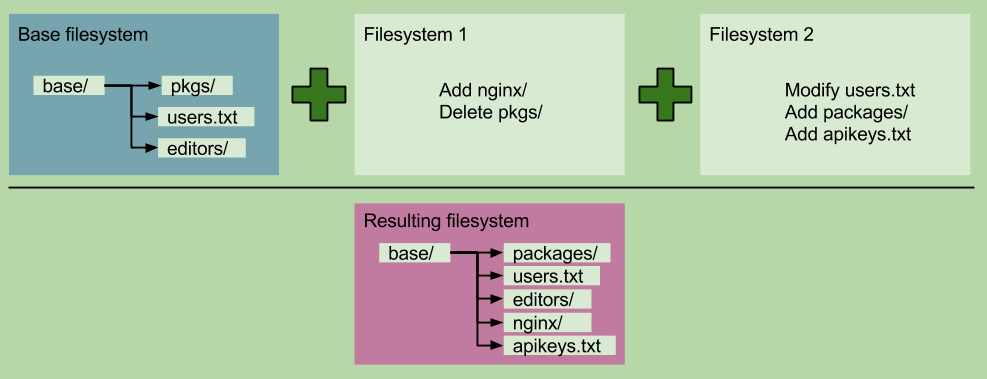
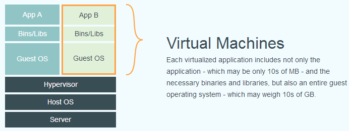
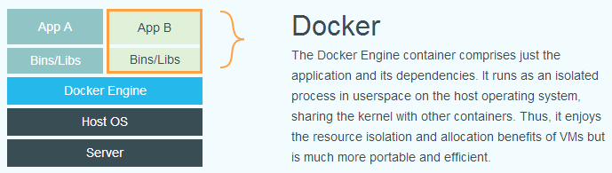
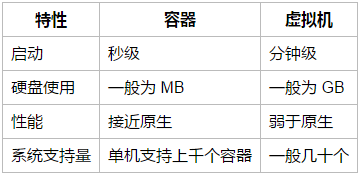

# docker底层实现

#### Docker 的基础是Linux容器（LXC）等技术。
在LXC的基础上Docker进行了进一步的封装，让用户不需要去关心容器的管理，使得操作更为简便。
Docker使用Cgroups来提供容器隔离，而union文件系统用于保存镜像并使容器变得短暂。
Cgroups：Cgroups是Linux内核功能，它让两件事情变成可能：限制Linux进程组的资源占用（内存、CPU）；为进程组制作 PID、UTS、IPC、网络、用户及装载命名空间。
Union文件系统：在union文件系统里，文件系统可以被装载在其他文件系统之上，其结果就是一个分层的积累变化。如下图：


#### 与虚拟机的关系
###### 用户操作Docker的容器就像操作一个快速轻量级的虚拟机一样简单。但是它们还是有很大的区别的，看下面两幅图：
- virtualization应用


- docker应用


- 官网的说法是：虚拟机上的应用不仅包含了应用本身、必要的依赖（二进制和库包等），还包括整个操作系统；而docker应用不同，共享系统内核，仅仅包含应用本身和依赖。

##### docker的优势：


##### docker的特性：

- 交互式Shell：Docker可以分配一个虚拟终端并关联到任何容器的标准输入上，例如运行一个一次性交互shell
- 文件系统隔离：每个进程容器运行在完全独立的根文件系统里
- 写时复制：采用写时复制方式创建根文件系统，这让部署变得极其快捷，并且节省内存和硬盘空间
- 资源隔离：可以使用cgroup为每个进程容器分配不同的系统资源
- 网络隔离：每个进程容器运行在自己的网络命名空间里，拥有自己的虚拟接口和IP地址
- 日志记录：Docker将会收集和记录每个进程容器的标准流（stdout/stderr/stdin），用于实时检索或批量检索
- 变更管理：容器文件系统的变更可以提交到新的映像中，并可重复使用以创建更多的容器。无需使用模板或手动配置

###### 打个比方
- 上面的概念很抽象吧，我说得通俗一些。
```
Linux（如ubuntu）运行一个应用，如tomcat，它需要依赖Java环境吧，其实就（可能）是把Java放在/usr/lib下，然后配置用户环境，使你可以在shell（如bash）上使用java指令，（可选）然后关联tomcat的bin目录下的startup.sh到用户环境上，完成上面两个步骤，就可以把tomcat运行起来。
docker方面

相对上面的tomcat例子，Docker就是通过
使用Cgroups隔离计算机资源，使计算机可以运行很多的服务；
使用Namespace分离打包服务运行时需要的所有依赖——java、tomcat，方便移植到新的计算机上，可以看下图（MacOS系统上运行docker）,你会发现此容器已经有java和tomcat；
```


