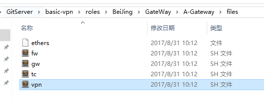
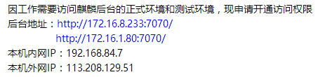
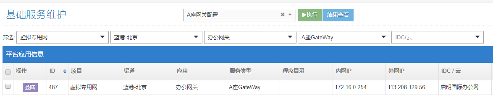

# 开通封闭内网到172.16测试端口权限
- 更新git
```
git pull
```
- git中找到vpn配置文件



- 修改配置文件



- 例：
```
/sbin/iptables -A FORWARD -s 192.168.84.7 -d 172.16.8.233 -p tcp -m multiport --dports 7070 -j ACCEPT
/sbin/iptables -A FORWARD -s 192.168.84.7 -d 172.16.1.80 -p tcp -m multiport --dports 7070 -j ACCEPT
```

- 设置名字，邮箱
```
git config --global user.email "wuqi@linekong.com"
git config --global user.name "wuqi"
```
- 上传修改文件
```
git commit -a -m "chenge A-Gateway vpn"
```
- gjobs 更新配置

 