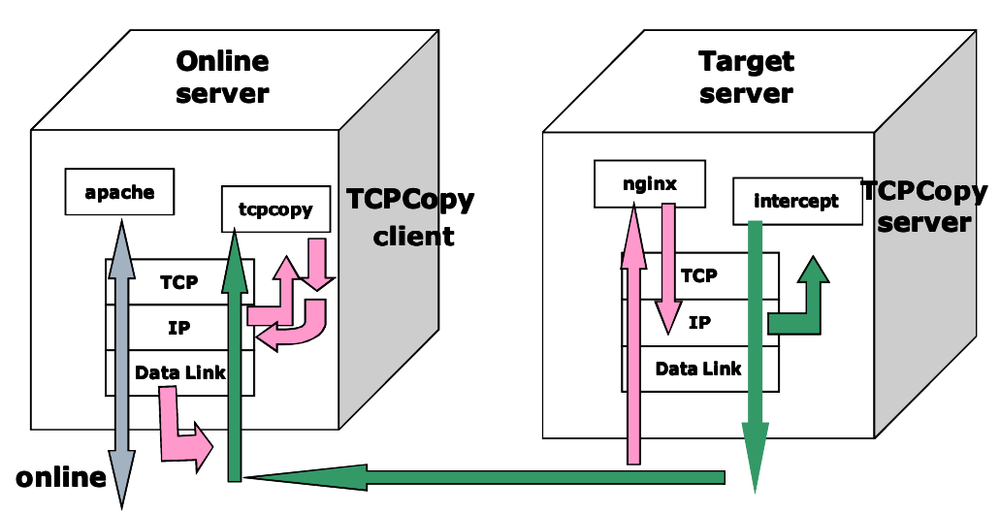

# TCPCOPY介绍
### tcpcopy介绍

- tcpcopy是一种请求复制工具。可以将线上流量拷贝到测试机器，实时的模拟线上环境。在不影响线上用户的情况下，使用线上流量进行测试，以尽早发现bug。也可以通过放大流量，进行压力测试，评估系统承载能力。

- tcpcopy可以从线上服务器的IP层抓取在线请求的数据包，修改相关属性，利用raw socket output技术（packet injection 技术之一）将其发送给测试服务器进行测试。

- 发送到测试服务器的数据包会在TCP/IP协议栈被识别，其中带有payload（tcp data）的数据包最终进入到测试服务器的上层应用（如nginx），上层应用在处理完请求之后，将响应传递给测试服务器的TCP/IP协议栈。

- 在测试服务器上启用ip_queue模块，并使用iptables在IP层将响应结果数据包发往QUEUE（ip_queue）。

- 测试服务器上运行在用户空间的拦截程序（intercept进程），通过打开netlink的socket接受内核通过ip_queue所传递来的网络数据包（即上层应用的响应内容）进行裁定，将结果返回内核，进行出队列的操作。intercept进程默认会丢弃上层应用的响应内容，返回ip header，以释放tcp连接。

- intercept进程也可以通过-x（passlist）参数，不drop指定ip lists发出请求的响应内容。默认drop是为了：
```
1 减少出口带宽占用，节约成本
2 不影响客户端（线上服务）的`TCP/IP`协议栈
3 不会在互联网上产生ghost数据包
tcpcopy工作流程
```



- 如上图，tcpcopy拷贝一次流量访问的步骤如下：
```
①　一个访问到达线上前端机；
②　socket数据包在ip层被拷贝了一份传给tcpcopy进程；
③　tcpcopy修改包的目的及源地址，发给目标测试机；
④　拷贝的包到达目标测试机；
⑤　目标测试机的nginx处理访问，并返回结果；
⑥　返回结果在ip层被截获、丢弃，由intercpet进程拷贝返回结果的ip header并返回；
⑦　ip header被发送给线上前端机的tcpcopy进程。
```
#### 安装和配置

- tcpcopy有两种工作模式：
```
1 实时拷贝数据包
2 通过使用tcpdump等抓包生成的文件进行离线（offline）请求重放
如果采用实时拷贝线上流程进行导入的方式，需要分别在线上服务器和测试服务器安装tcpcopy，对于离线模式，只需要在测试服务器上安装tcpcopy，编译时指定 --enable-offline。
```
- 安装步骤如下：
```
wget https://github.com/wangbin579/tcpcopy/archive/0.9.0.tar.gz -O tcpcopy-0.9.0.tar.gz --no-check-certificate
tar zxvf tcpcopy-0.9.0.tar.gz
cd tcpcopy-0.9.0
./autogen.sh
./configure --prefix=/usr/local/tcpcopy
make
sudo make install
```
- 目标测试机配置

- 线上服务器拷贝的数据包发送至测试服务器进行处理之后，测试服务器需要通过iptables将响应结果发送至QUEUE（ip_queue），这样测试服务器上运行的intercept拦截进程才能通过打开的netlinksocket获取传递过来的数据包并进行裁定。所以测试服务器上需要开启iptables防火墙，并启用内核模块ip_queue
```
modprobe ip_queue
/etc/init.d/iptables start
```
- 因为线上服务器需要和目标测试服务器通信，传递请求数据包和控制信息（封装的ip packet header），所以需要在测试服务器上添加相关iptables防火墙规则。编辑/etc/sysconfig/iptables，添加：
```
-A RH-Firewall-1-INPUT -m state --state NEW -m tcp -p tcp --dport 80 -j ACCEPT
-A RH-Firewall-1-INPUT -m state --state NEW -m tcp -p tcp --dport 36524 -j ACCEPT
```
然后重启iptables
```
/etc/init.d/iptables restart
```
接着执行：
```
iptables -I OUTPUT -p tcp --sport 80 -j QUEUE
```
将响应结果发送至QUEUE（ip_queue），从而实现运行在用户态的进程对相关数据包进行裁定。

相关使用

本文以线上和测试机的web服务都使用80端口，传递控制信息使用默认的36524端口为例。如果使用别的端口，记得修改相关iptables防火墙规则。

#### 离线 offline
```
1） 在线上服务器抓包

tcpdump -i eth0 tcp and port 80 -s 0 -w online.pcap
2） 将抓包生成的文件拷贝到测试服务器

3） 在测试服务器上进行执行如下命令进行重放

cd /usr/local/tcpcopy/bin
sudo ./intercept
sudo ./tcpcopy -i /path/online.pcap -x 80-10.16.12.11:80

tcpcopy -i <抓包文件地址> -x <port>-<本地ip>:<port>
```
#### 在线实时复制 online
```
1） 在测试服务器上启动intercept拦截进程

cd /usr/local/tcpcopy/bin
sudo ./intercept
2） 在线上服务器复制流量到测试服务器

cd /usr/local/tcpcopy/bin
sudo ./tcpcopy -x 80-10.16.12.11:80 -c 10.16.12.12

tcpcopy -x 服务器应用端口号-测试服务器ip地址:测试服务器应用端口 -c 本地服务器ip
```