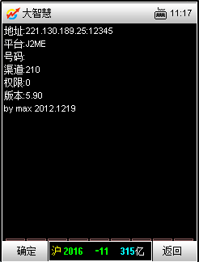
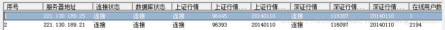
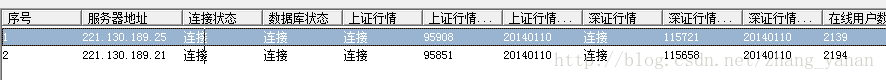
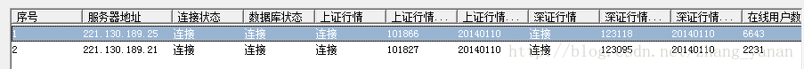
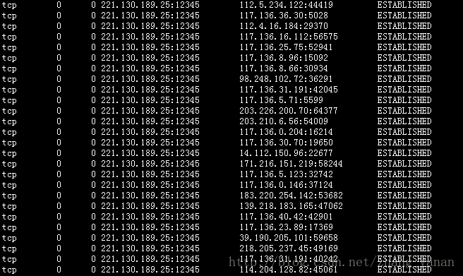

# tcpcopy
#### tcpcopy参数说明
- 1 -x 参数
```
格式：-x <transfer,>
Transfer 具体格式如下：
服务器对外IP 地址:服务器应用端口号-测试服务器IP地址：测试服务器应用端口
Transfer 之间用“,”隔开，IP 地址和端口号之间用“:”隔开，服务器应用端口号和测
试服务器IP 地址之间用‘-’隔开
举例：（在生产环境服务器上执行下边命令，80是行情端口，192.168.0.2是测试ip，18080是测试端口）
./tcpcopy -x 80-192.168.0.2:18080
复制在线机器的80 端口应用的请求到192.168.0.2 上面的18080 端口
```
- 2 -i 参数
```
在离线模式下使用哪个离线文件
格式：-i <file>
其中file 是pcap 离线文件的文件路径
举例：tcpcopy -i online.pcap -x 12345-221.130.189.25:12345
```
- 3 -o 参数
```
格式：-o < device,>
指定从哪个网卡设备上发包
举例：
tcpcopy -o eth0 -x 12345-221.130.189.25:12345
从eth0 设备上来发包
- 需注意如下事项：
1）此参数只有在编译./configure --enable-dlinject 模式下才有效
l --enable-dlinject说明
此模式是为了支持tcpcopy 能够从数据链路层发送请求数据包。
从数据链路层发包的好处是不会去干扰在线服务器的IP 模块（比如不会去干扰ip_conntrack 模块），但不好的地方是需要自己去解决路由问题。
2）-o 参数需要设置成与转发IP 地址相匹配的网卡设备
比如：转发IP 地址为外网IP 地址，那么-o 参数就设置成外网网卡设备的名称
```
- 4 -I 参数
```
离线模式下，降低请求之间的间隔，对稀疏的请求访问，其加速非常有效果
举例：
./tcpcopy -x 80-192.168.0.2:8080 -I 1000 -i online.pcap
对请求之间间隔1000毫秒以外的请求进行加速
注意只有在离线模式下有效
```
- 5 -a 参数
```
离线模式下，对请求数据包的访问进行加速
举例：
假设online.pcap 文件为在线请求数据包的抓包文件，时间为60 分钟
./tcpcopy -x 80-192.168.0.2:8080 -a 2 -i online.pcap
执行此命令后，离线回放加速了2 倍，只需要30分钟，离线回放就能完成
需要注意的是，此命令只有在离线模式下才有效，而且-a 参数设置越大，丢请求的概率
也越大。
```
- 6 -B 参数
```
格式：-B < num>
指定pcap 抓请求数据包的缓冲区大小，默认为16（单位为M）
举例：tcpcopy  -x 12345-221.130.189.25:12345 -B 32
需要注意的是此参数只有在pcap 模式下才有效（编译./configure --enable-pcap 的情况下）
l --enable-pcap说明
这种模式是为了能够利用pcap 库（1.0 版本及其以后）进行抓包，利用pcap 的内核过滤接口，理论上可以提升抓请求数据包的效率，比如当在线机器应用种类比较多，需要复制某一个应用的请求到测试系统的时候，这种方式效率会比较高。
```
- 7 -F 参数
```
格式：-F < filter>
指定抓包的过滤条件，具体格式可以参考tcpdump 或者pcap filter 的格式
一旦设置此参数，tcpcopy 不会自动去构造filter，采用-F 参数指定的filter 去过滤请求
数据包
举例：
tcpcopy  -x 12345-221.130.189.25:12345 -F 'tcp and dst port 11311 and dst host 10.100.10.1'
复制目的地址为10.100.10.1 且目的端口为11311 的TCP 请求数据包
需要注意的是此参数只有在pcap 模式下才有效（编译./configure --enable-pcap 的情况下）
--enable-pcap说明参见3.6
```
- 8 -C 参数
```
指定tcpcopy 和intercept 之间的连接数量，默认为2 条连接供响应包的返回和路由信息的传递，最高16条。在高压情况下，加大此参数，可以提高吞吐量，但整体性能会有一定程度的下降。
举例：
tcpcopy  -x 12345-221.130.189.25:12345 -C 4
```
- 9 -c 参数
```
格式：-c <IP,>
改变请求数据包的源IP地址为IP地址列表中的某个IP地址
举例:
假设你复制的请求是本地localhost(127.0.0.1)的请求（比如抓包得到的结果类似于
127.0.0.1:80à127.0.0.1:8080），那么直接复制这样的请求到其它机器上去，一般是不行的，
需要修改数据包的源IP地址，-c参数就是用来改变源IP 地址的。
举例
./tcpcopy -x 8080-192.168.0.2:8080 -c 192.168.0.1
复制127.0.0.1上面的8080端口应用的请求到192.168.0.2上面的8080端口，同时修改
源IP地址127.0.0.1为192.168.0.1地址。
需要注意如下内容：
1）此参数在跨网段安全性比较高的场合，比较有效。
2）tcpcopy 仅仅改变客户端IP，不会自动解决改变所带来的端口冲突问题。
3）当客户端IP 地址较多时，为了尽可能地避免端口冲突问题，IP 地址列表的数目一般
越多越好。
```
- 10 -n 参数
```
如果你要进行多重复制，那么此参数的值就是代表复制过去的流量是在线的n 倍，倍数
越小，效果越好，因为多重复制的原理是修改端口号，因此复制的倍数越大，端口冲突的概
率越大，特别是源IP 地址非常少，短连接的的内网应用场合。系统默认最大值为1023 倍。
举例
./tcpcopy -x 80-192.168.0.2:8080 -n 3
复制3 倍的在线服务器的80 端口应用请求流量到192.168.0.2 的8080 端口
```
- 11 -f 参数
```
如果你要运行多个tcpcopy 实例，复制请求到同一台测试服务器上面去，那么此参数就
是为此设置的，常见于逐步增大流量的场合。最大值为1023。
举例：
./tcpcopy -x 80-192.168.0.2:8080
./tcpcopy -x 80-192.168.0.2:8080 -f 1
./tcpcopy -x 80-192.168.0.2:8080 -f 2
这里我们在在线服务器运行三个实例，可以把测试服务器的流量放大到在线的3 倍。
需要注意的是，如果要用-f 参数，复制给同一台测试服务器上面的同一个应用的不同tcpcopy 实例之间的-f 参数的值必须是不同的。
```
- 12 -r 参数
```
如果你想复制在线服务器应用的部分流量，可以采用-r 参数来实现，参数范围是1～99，
其它值都是全流量复制。
举例：
./tcpcopy -x 80-192.168.0.2:8080 -r 20
这里tcpcopy 复制在线服务器8080 端口应用的20%流量给后端服务器，需要注意的是
20%是根据session（这里session 是由客户端IP，客户端端口决定）来统计的。
-r 参数常见于对测试应用进行profile 的场合或者测试服务器配置不如在线服务器的场
合。
```
- 13 -M 参数
```
此参数设置tcpcopy 发送数据包的MTU 值，默认为1500 字节，如果系统MTU 值小于
1500 字节，需要调整此参数，否则会导致tcpcopy 发送数据包失败。
举例：tcpcopy  -x 12345-221.130.189.25:12345 -M 1200
```
- 14 -m 参数
```
此参数一般只有在Linux 内核2.6.32 版本及其以后版本才有效，如果内存超过了此设置值，那么tcpcopy 就自动退出，默认是512M，这是为了保护在线，防止tcpcopy 占用过多内存。
举例：tcpcopy  -x 12345-221.130.189.25:12345 -m 1024
```
- 15 -s 参数
```
格式：-s <server,> intercept server list
server 具体格式如下：
ip_addr1:port1, ip_addr2:port2, ...
指定真正运行intercept 的地址列表，通过此参数可以和任意一台服务器的任意一个
intercept 实例进行通信。
举例如下：
./tcpcopy -x 80-10.120.12.211:28080 -s 10.120.12.161:36525
复制在线80 端口的流量到IP 地址为10.120.12.211 的测试子系统中去（其中测试系统
上面运行28080 端口服务）， 并设置tcpcopy 与intercept 的通信地址列表（ tcpcopy 与
10.120.12.161 上面的36525 端口的intercept 通信）。
注意：
-s 参数只有编译./configure --enable-dr 或者新架构下才有效
l --enable-dr说明
经过编译后，工作在DR模式。DR模式取之于LVS 的DR 应用场景，是为了解决复制在线流量给带有LVS(由于大部分场景下采用DR)的子系统。
由于在线流量复制给LVS 后，LVS会把不同连接的数据包按照一定的策略分发给不同的测试服务器，导致了与常规TCPCopy 用法的不同。
下面内容讲述的是在传统架构下的DR 模式相关内容。
为了解决响应包如何返回的问题，此模式下的tcpcopy 会把每个会话的路由信息传递给每一台测试服务器上面相应的intercept。因此tcpcopy 执行命令的时候会多出-s 参数，用来指定真正的real server 的IP 地址，而intercept 则需要设置-x 参数，参数的值就是LVS服务器的所用的实际IP地址，设置的目地是让LVS 发出的数据包（即检测real server 的健康程度的数据包）能够通过测试服务器的IP层，这样LVS 才会认为这些real server 是健康的，而不是处于崩溃的状态。
理论上，如果数据包到达测试服务器之前，其目的IP 地址存在NAT 变换（DestinationNetwork Address Translation.），也就是说目的IP地址会被改变的情况下，那么DR模式也能适用，这种场景下的应用可以看成是DR的一种特殊应用场景。
值得注意的是，默认情况下，如果LVS 子系统中的一台real server 机器上面intercept进程崩溃后，仅仅重新启动intercept， TCPCopy 不会正常工作，需要重新启动所有tcpcopy才能顺利工作，为了避免此麻烦， tcpcopy 运行的时候需要加上-L 参数即可解决此问题。
```
- 16 -t 参数
```
如果你的在线应用响应非常慢或者长连接应用的场合，那么推荐设置更大的-t 参数值（默认是120s，如果120s 内没有收到测试服务器的响应，那么这个请求会话就可能被tcpcopy给丢弃掉）。
举例：
tcpcopy  -x 12345-221.130.189.25:12345 -t 180
```
- 17 -l 参数
```
设置错误日志文件的路径
举例：tcpcopy  -x 12345-221.130.189.25:12345 -l /tmp/error.log
```
- 18 -p 参数
```
格式:-p <num> remote server listening port
远程intercept 的监听端口，默认是36524。
举例：
tcpcopy  -x 12345-221.130.189.25:12345 -p 36525
注意事项：
在configure --enable-dr 或者新架构下，如果tcpcopy 在-s参数中仅仅设置了IP 地址，那么端口就采用默认的-p参数值；如果-s参数设置了端口号，那么系统将替换掉-p参数所设置的端口值。
```
- 19 -d 参数
```
设置tcpcopy以daemon（后台）运行
举例：
tcpcopy  -x 12345-221.130.189.25:12345 -d
检查进程就可以发现
ps -ef | grep tcp
root     1452     1  1 16:29       00:00:00 tcpcopy -x 12345-221.130.189.25:12345 -d
```

### tcpcopy模拟实验

- 1 服务器列表
```
我们模拟手机行情服务器进行实验，通过以下两台服务器：
服务功能名
IP地址
生产手机行情服务器
221.130.189.21
测试手机行情服务器
221.130.189.25
```
##### 在线版tcpcopy软件部署

- 2.1 tcpcopy安装
```
在线版tcpcopy软件生产行情服务器和测试行情服务器都要进行安装
tar-zxvf tcpcopy-0.9.6.tar.gz
cdtcpcopy-0.9.6
./configure
make
make install
```
- 2.2 测试行情服务器端（221.130.189.25）操作
```
设置防火墙并开启接收端
#modprobe ip_queue                                启动内核模块
#iptables -I OUTPUT -p tcp --sport 12345 -j QUEUE    禁止12345端口的回包
#intercept                                           开启接收端
之后会进行等待接受状态，要另外操作请新开窗口，不要关闭窗口，停止接受用ctrl+c
```
- 2.3 生产行情服务器（221.130.189.21）操作
```
将生产行情服务器tcpcopy开启
tcpcopy  -x 12345-221.130.189.25:12345
Tcpcopy截获生产行情服务器（221.130.189.21:12345）端口访问数据进行copy，传输到测试行情服务器（221.130.189.25:12345）端口，模拟用户正常访问。
- 进行压力测试
为了配合压力测试，通过添加-n参数，-n参数后的数值为压力倍数。
tcpcopy  -x 12345-221.130.189.25:12345 -n 3
进行3倍的数量进行测试
```
#### 离线版tcpcopy软件部署
- 3.1 tcpcopy安装
```
如已经安装可以先卸载，没有安装略过
cd tcpcopy-0.9.6
make uninstall

离线版tcpcopy只需在测试行情服务器安装即可
tar-zxvf tcpcopy-0.9.6.tar.gz
cd tcpcopy-0.9.6
./configure --enable-offine
make
makeinstall
```

- 3.2 生产行情服务器（221.130.189.21）操作
```
使用tcpdump命令生成抓包文件
tcpdump -i any tcp and port 12345 -s 0 -w online.pcap

将online.pcap文件拷贝到测试行情服务器上（221.130.189.25）
```
- 3.3 测试行情服务器端（221.130.189.25）操作
```
设置防火墙并开启接收端

#modprobe ip_queue                                启动内核模块
#iptables -I OUTPUT -p tcp --sport 12345 -j QUEUE    禁止12345端口的回包
#intercept                                           开启接收端
之后会进行等待接受状态，要另外操作请新开窗口，不要关闭窗口，停止接受用ctrl+c
l 需要用到libpcap软件包，进行rpm安装
rpm -ivh libpcap-0.9.4-15.el5.x86_64.rpm
rpm -ivh libpcap-devel-0.9.4-15.el5.x86_64.rpm
l 将测试行情服务器tcpcopy开启
tcpcopy -i online.pcap -x 12345-221.130.189.25:12345
命令运行后测试行情服务器已经进入测试状态，测试时间等于进行抓包文件时间长度，测试完毕会自动退出，手动强行停止请用ctrl+c
l 进行压力测试
为了配合压力测试，通过添加-n参数，-n参数后的数值为压力倍数。
tcpcopy -i online.pcap -x 12345-221.130.189.25:12345 -n 4
进行4倍的数量进行测试
```

##### tcpcopy测试
- 4.1 客户端登陆测试
```
测试行情服务器操作
如果需要用手机客户端登陆模拟服务器进行测试的话，需要进行如下设置
手机客户端IP（180.169.10.222和180.169.10.238）IP地址的请求允许回包，通过intercept添加-x参数，-x后为ip列表。
intercept -x 180.169.10.222,180.169.10.238

客户端登陆正常，查询登陆确为测试服务器221.130.189.25（图3）。
```



- 4.2 生产环境请求数据导入

未开始测试前服务器连接数比对，如图4



开启程序后可通过在线人数看出tcpcopy已完成实时复制（丢包率在4%左右，属正常现象），如图5


通过添加-n参数来完成加倍的压力测试，如图6
tcpcopy  -x 12345-221.130.189.25:12345 -n 3




- 4.3 行情服务端测试

测试客户端链接状态
通过客户端连接只测试服务器221.130.189.25上，可查看到客户端的IP地址及与服务的链接状态。如图7



生产环境数据导入后链接状态，如图8


#### Mysqlcopy模拟实验

我们通过以下服务器进行做实验：
```
服务功能名
IP地址
生产数据库服务器
10.15.62.241
测试数据库服务器
10.15.62.201
客户端服务器
10.15.62.157
```

- 2 tcpcopy安装
```
tcpcopy必须生产和测试行情服务器都进行安装
tar-zxvf tcpcopy-0.9.6.tar.gz
cdtcpcopy-0.9.6
./configure --enable-mysql
make
makeinstall
```

- 3 测试数据库服务器操作
```
设置防火墙并开启接收端
#modprobe ip_queue                                启动内核模块
#iptables -I OUTPUT -p tcp --sport 12345 -j QUEUE    禁止12345端口的回包
#intercept                                           开启接收端
之后会进行等待接受状态，要另外操作请新开窗口，不要关闭窗口，停止接受用ctrl+c
设置数据库用户权限
允许客户端IP访问数据库
grant all privileges on *.* to dzh@'10.15.62.157' identified by '123456';
如果是许多客户端可以将IP换成“%”，允许所有人访问。比如：
grant all privileges on *.* to dzh@'%' identified by '123456';
```
- 4 生产数据库服务器操作
```
设置数据库用户权限
允许测试服务器访问数据库
grant all privileges on *.* to dzh@'10.15.62.201' identified by '123456';
允许客户端IP访问数据库
grant all privileges on *.* to dzh@'10.15.62.157' identified by '123456';
如果是许多客户端可以将IP换成“%”，允许所有人访问。比如：
grant all privileges on *.* to dzh@'%' identified by '123456';
l 将生产行情服务器tcpcopy开启
tcpcopy -x 3306-10.15.62.201:3306 -d -u dzh@123456
@前面是用户，后面是密码，可以指定多个用户进行测试，用户之间可以用逗号分开，比如：
tcpcopy -x 3306-10.15.62.201:3306 -d -u dzh@123456,root@123456
l 检查进程是否存在，程序启动是否成功
ps -ef | grep tcp
root   17942  1  2 16:13 ?    00:00:53 tcpcopy -x 3306-10.15.62.201:3306 -d -u dzh@123456
```

- 5 Mysqlcopy测试
5.1 模拟一般测试
```
客户端服务器对生产数据库服务器进行远程操作增加数据库命令
mysql -u dzh -h 10.15.62.241 -e "create database taozt" -p
Enter password: 
l 登陆生产数据库服务器检查日志和数据库情况
查看数据库发现已经创建数据库
mysql> show databases;
+--------------------+
| Database           |
+--------------------+
| information_schema | 
| mysql              | 
| sbtest             | 
| taozt              | 
| test               | 
+--------------------+
5 rows in set (0.00 sec)
查看日志（日志文件在运行程序当前目录下）发现已经将信息传送给测试服务器
tailf error_tcpcopy.log
2014/01/21 17:10:01 +913 [warn] user:dzh,pwd:456789     #测试数据库的用户和密码
2014/01/21 17:10:01 +913 [notice] recv clt:10.15.62.157:56238-->10.15.62.241:3306,len 113,seq=2856730103,ack=2902579166
2014/01/21 17:10:01 +913 [notice] recv clt:10.15.62.157:56238-->10.15.62.241:3306,len 65,seq=2856730164,ack=2902579171
2014/01/21 17:10:05 +503 [notice] active:0,rel reqs:1,obs del:0
2014/01/21 17:10:05 +503 [notice] conns:1,resp packs:8,c-resp packs:5
2014/01/21 17:10:05 +503 [notice] send Packets:14,send content packets:5    #传送数据情况
2014/01/21 17:10:05 +503 [notice] send fin Packets:1,send reset packets:0
2014/01/21 17:10:05 +503 [notice] reconnect for closed :0,for no syn:0
2014/01/21 17:10:05 +503 [notice] retransmit:0
2014/01/21 17:10:05 +503 [notice] successful retransmit:0
2014/01/21 17:10:05 +503 [notice] syn cnt:1,all clt packs:10,clt cont:5
2014/01/21 17:10:05 +503 [notice] total client content retransmit:0
2014/01/21 17:10:05 +503 [notice] total captured pakcets:93
2014/01/21 17:10:05 +503 [notice] dropped client packets:0
2014/01/21 17:10:05 +503 [notice] mysql table size:65536
l 登陆测试服务器查看数据库
查看数据库发现也创建了同样库，mysqlcopy测试成功
mysql> show databases;
+--------------------+
| Database           |
+--------------------+
| information_schema | 
| mysql              | 
| sbtest             | 
| taozt              | 
| test               | 
+--------------------+
5 rows in set (0.00 sec)
```
- 5.2 模拟压力测试（客户端服务器操作）
```
l sysbench软件介绍
sysbench是一款开源的多线程性能测试工具，可以执行CPU/内存/线程/IO/数据库等方面的性能测试。数据库目前支持MySQL/Oracle/PostgreSQL。
我们目前只是进行数据库远程性能测试。
下载安装sysbench
登陆http://sourceforge.net/网站搜索sysbench进行下载
安装sysbench
tar zxf sysbench-0.4.12.tar.gz
cd sysbench-0.4.12
./configure && make && make install

如果在编译过程中出现libtool error，解决方法如下：
vi sysbench-0.4.12/configure.ac
#AC_PROG_LIBTOOL #将这句注释，前面加上#
AC_PROG_RANLIB  #增加这句话
cd sysbench-0.4.12
./autogen.sh
然后重新编译安装
./configure && make && make install
l 进行压力测试
sysbench --test=oltp --mysql-table-engine=myisam --oltp-table-size=100000 --mysql-socket=/tmp/mysql.sock --mysql-user=root --mysql-host=10.15.62.241 --mysql-password=123456 prepare
默认测试表是sbtest，必须先在生产和模拟服务器中创建好。
参数说明：
--test  测试类型  
--mysql-table-engine  表存储引擎类型
--oltp-table-size  测试表的连接数
--mysql-socket  指定mysql连接文件存放位置
--mysql-user  连接生产服务器mysql的用户
--mysql-host  连接生产服务器的IP地址
--mysql-password  连接生产服务器的mysql用户密码
prepare  准备开始测试
```


