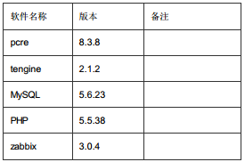

# zabbix安装配置

#### 环境：Centos 6.5 X64


- 说明：
CentOS 6.5 默认使用yum安装的Apahce是2.2 和Php5.3.3，但是Zabbix 3.0要求PHP软件版本5.4或更高版本，
所以采用 手动编译 LNMP更高版本来进行安装 Zabbix软件，Zabbix 3.0对web界面进行了更好的优化。

#### 安装Nginx
- 安装前准备工作：
```
yum -y install gcc gcc-c++ autoconf automake
yum -y install zlib zlib-devel openssl openssl-devel pcre pcre-devel gd gd-devel
yum -y install GeoIP GeoIP-devel
yum -y install libxslt libxml2
yum -y install libxslt-devel libxml2-devel
```

- 安装pcre（为了让nginx支持rewrite模块）
```
 tar zxf pcre-8.38.tar.gz
cd pcre-8.38
./configure &&make &&make install
cd ..
```
- 创建Ningx用户
```
useradd nginx -M -s /sbin/nologin
```

- 修改Ningx显示信息：
```
tar zxf tengine-2.1.2.tar.gz
vi tengine-2.1.2/src/core/nginx.h #以下为修改后内容
#define TENGINE "Web"
#define tengine_version 2001002
#define TENGINE_VERSION "8.8"
#define TENGINE_VER TENGINE "/" TENGINE_VERSION
#define NGINX_VAR "WEB"
```

- 安装nginx软件
```
cd tengine-2.1.2
./configure \
--user=nginx \
--group=nginx \
--prefix=/application/tengine \
--with-http_stub_status_module \
--with-http_ssl_module \
--with-http_gzip_static_module \
--with-pcre=../pcre-8.38  #注意pcre-8.38的软件解压目录路径

make && make install

echo 'export PATH=$PATH:/application/tengine/sbin' >>/etc/profile
. /etc/profile

echo '/usr/local/lib' >>/etc/ld.so.conf
ldconfig
ln -s /application/tengine /application/nginx
```

- 安装MySQL(可以和zabbix不在同一台机器）
```
yum install cmake make -y
yum install gcc gcc-c++ autoconf bison automake zlib* fiex* libxml* ncurses-devel libmcrypt* libtoolltdl-devel* -y

tar zxf mysql-5.6.23.tar.gz
cd mysql-5.6.23
useradd -M -s /sbin/nologin mysql
mkdir -p /data/mysql
chown -R mysql.mysql /data/mysql
mkdir /data/mysql-slow-log
chown mysql.mysql /data/mysql-slow-log

cmake -DCMAKE_INSTALL_PREFIX=/usr/local/mysql \
-DMYSQL_UNIX_ADDR=/data/mysql/mysql.sock \
-DDEFAULT_CHARSET=utf8 \
-DDEFAULT_COLLATION=utf8_general_ci \
-DWITH_EXTRA_CHARSETS=complex \
-DWITH_INNOBASE_STORAGE_ENGINE=1 \
-DWITH_READLINE=1 \
-DENABLED_LOCAL_INFILE=1 \
-DMYSQL_DATADIR=/data/mysql/ \
-DMYSQL_USER=mysql \
-DMYSQL_TCP_PORT=3306
make && make install

echo 'export PATH=$PATH:/usr/local/mysql/bin'>>/etc/profile
tail -1 /etc/profile
source /etc/profile
\cp support-files/mysql.server /etc/init.d/mysqld
chmod 700 /etc/init.d/mysqld
```

- 编辑 my.cnf 配置文件
```
vi /etc/my.cnf
[client]
port = 3306
socket = /data/mysql/mysql.sock
default-character-set = utf8
[mysqld]
port = 3306
socket = /data/mysql/mysql.sock
datadir = /data/mysql/
skip-external-locking
key_buffer_size = 16M
max_allowed_packet = 30M
table_open_cache = 64
sort_buffer_size = 512K
net_buffer_length = 8K
read_buffer_size = 256K
read_rnd_buffer_size = 512K
myisam_sort_buffer_size = 8M
default-storage-engine = INNODB
character-set-server = utf8
collation-server = utf8_general_ci
#character-set-server = utf8mb4
#collation_server = utf8mb4_unicode_ci
event_scheduler=ON
open_files_limit = 10240
max_connections = 3000
max_connect_errors = 6000
thread_stack = 192K
transaction_isolation = REPEATABLE-READ
tmp_table_size = 256M
max_heap_table_size = 256M
log-bin=mysql-bin
binlog_format=mixed
server-id = 1
[mysqldump]
quick
max_allowed_packet = 16M
[mysql]
no-auto-rehash
[myisamchk]
key_buffer_size = 20M
sort_buffer_size = 20M
read_buffer = 2M
write_buffer = 2M
[mysqlhotcopy]
interactive-timeout
```
- 修改权限.初始化.启动mysql
```
chmod 755 scripts/mysql_install_db
scripts/mysql_install_db --user=mysql --basedir=/usr/local/mysql --datadir=/data/mysql/
/etc/init.d/mysqld start
```
- 设置mysql root密码
```
mysqladmin -uroot password '123456'
```

- 登录mysql
```
mysql -uroot -p'sql123456'
```

##### 常见问题
```
#创建zabbix数据库，并指定字符集为UTF8
#如果数据库是非 utf8 字符，则 web 页面改为中文，是会出现乱码的
create database zabbix character set utf8;
#创建数据库帐号，如果是非本地，则IP地址写远程数据库IP地址
grant all privileges on zabbix.* to zabbix@localhost identified by 'zabbix';
flush privileges;
#测试该帐号是否可以登录数据库
mysql -uzabbix -pzabbix
```

#### 安装PHP
```
tar zxf libiconv-1.14.tar.gz
cd libiconv-1.14
./configure --prefix=/usr/local/libiconv
make
make install
cd ..

tar zxf libmcrypt-2.5.8.tar.gz
cd libmcrypt-2.5.8
./configure
make && make install
ldconfig
cd libltdl/
./configure --enable-ltdl-install
cd ../../

tar zxf php-5.5.38.tar.gz
cd php-5.5.38
./configure \
--prefix=/application/php-5.5.38 \
--with-mysql=/usr/local/mysql \
--with-mysqli=/usr/local/mysql/bin/mysql_config \
--with-pdo-mysql=/usr/local/mysql \
--with-iconv-dir=/usr/local/libiconv \
--with-iconv=/usr/local/libiconv \
--with-freetype-dir \
--with-jpeg-dir \
--with-png-dir \
--enable-zend-multibyte \
--with-zlib \
--with-libxml-dir \
--with-gettext \
--enable-xml \
--disable-rpath \
--enable-bcmath \
--enable-shmop \
--enable-sysvsem \
--enable-inline-optimization \
--with-curl \
--enable-mbregex \
--enable-fpm \
--enable-mbstring \
--with-mcrypt \
--with-gd \
--enable-gd-native-ttf \
--with-openssl \
--with-mhash \
--enable-pcntl \
--enable-sockets \
--with-xmlrpc \
--enable-soap \
--enable-short-tags \
--enable-static \
--with-xsl \
--with-fpm-user=nginx \
--with-fpm-group=nginx \
--enable-ftp \
--enable-opcache=no

make && make install

ln -s /application/php-5.5.38 /application/php
cp /application/tools/php-5.5.38/php.ini-production /application/php/lib/php.ini
cp /application/tools/php-5.5.38/sapi/fpm/init.d.php-fpm /etc/init.d/php-fpm
cp /application/php/etc/php-fpm.conf.default /application/php/etc/php-fpm.conf
chmod 755 /etc/init.d/php-fpm
vi /application/php/etc/php-fpm.conf
#将用户名和组修改为nginx配置文件指定的用户名:默认是nobody
```

##### nginx配置文件
```
user nginx nginx;
worker_processes 2;
error_log logs/nginx_error.log crit;
pid logs/nginx.pid;
worker_rlimit_nofile 51200;
events
{
use epoll;
worker_connections 51200;
}
http
{
include mime.types;
default_type application/octet-stream;
log_format main '$remote_addr - $remote_user [$time_local] "$request" '
 '$status $body_bytes_sent "$http_referer" '
 '"$http_user_agent"';
 server_names_hash_bucket_size 128;
 client_header_buffer_size 32k;
 client_max_body_size 20m;
 large_client_header_buffers 4 32k;
 sendfile on;
 keepalive_timeout 30;
 tcp_nodelay on;
 fastcgi_connect_timeout 300;
 fastcgi_send_timeout 300;
 fastcgi_read_timeout 300;
 fastcgi_buffer_size 64k;
 fastcgi_buffers 4 64k;
 fastcgi_busy_buffers_size 128k;
 fastcgi_temp_file_write_size 128k;
 gzip on;
 gzip_min_length 1k;
 gzip_buffers 4 16k;
 gzip_http_version 1.1;
 gzip_comp_level 2;
 gzip_types text/plain application/x-javascript text/css application/xml;
 gzip_vary on;
server {
 listen 80;
 server_name 192.168.10.193;
 root /data/www;
 index index.php index.html index.htm;

 location ~ \.(php|php5)?$ {
 fastcgi_pass 127.0.0.1:9000;
 fastcgi_index index.php;
 fastcgi_param SCRIPT_FILENAME $document_root$fastcgi_script_name;
 include fastcgi_params;
 }
 }
}

cat index.php
<?php
phpinfo();
?>
```

##### zabbix安装
- php设置
```
sed -i "s/;date.timezone =/date.timezone = Asia\/Shanghai/g" /application/php/lib/php.ini
sed -i "s#max_execution_time = 30#max_execution_time = 300#g" /application/php/lib/php.ini
sed -i "s#post_max_size = 8M#post_max_size = 32M#g" /application/php/lib/php.ini
sed -i "s#max_input_time = 60#max_input_time = 300#g" /application/php/lib/php.ini
sed -i "s#memory_limit = 128M#memory_limit = 128M#g" /application/php/lib/php.ini
sed -i "/;mbstring.func_overload = 0/ambstring.func_overload = off\n" /application/php/lib/php.ini
```

- zabbix安装与设置
```
yum -y install gcc gcc-c++ autoconf mod_ssl mod_perlmod_auth_mysqlmysql-connector-odbc libdbi-dbdmysql
net-snmp-devel curl-devel unixODBC-devel OpenIPMI-devel java-devel libssh2-devel.x86_64
groupadd zabbix -g 201
useradd -g zabbix -u 201 -m zabbix
tar zxf zabbix-3.0.4.tar.gz
cd zabbix-3.0.4
./configure --prefix=/usr \
--sysconfdir=/etc/zabbix \
--enable-server \
--enable-proxy \
--enable-agent \
--enable-ipv6 \
--with-mysql \
--with-net-snmp \
--with-libcurl \
--with-openipmi \
--with-unixodbc \
--with-ldap \
--with-ssh2 \
--enable-java
make && make install

create database zabbix character set utf8;
grant all privileges on zabbix.* to zabbix@localhost identified by 'zabbix';
flush privileges;
```

- 导入sql文件,有顺序要求。
```
cd /application/zabbix-3.0.4/database/mysql
mysql -uzabbix -pzabbix zabbix < schema.sql
mysql -uzabbix -pzabbix zabbix < images.sql
mysql -uzabbix -pzabbix zabbix < data.sql
```

- 创建日志目录
```
mkdir /var/log/zabbix
chown zabbix.zabbix /var/log/zabbix
```

- 复制启动文件及赋予权限
```
cp misc/init.d/fedora/core/zabbix_* /etc/init.d/
chmod 755 /etc/init.d/zabbix_*
```

- 修改启动文件
```
sed -i "s#BASEDIR=/usr/local#BASEDIR=/usr/#g" /etc/init.d/zabbix_server
sed -i "s#BASEDIR=/usr/local#BASEDIR=/usr/#g" /etc/init.d/zabbix_agentd
```

- 修改 /etc/zabbix/zabbix_server.conf
```
DBName=zabbix # 数据库名称
DBUser=zabbix # 数据库用户
DBPassword=zabbix # 数据库密码
LogFile=/var/log/zabbix/zabbix_server.log #日志文件路径

#对 server 本身进行监控，所以要对 zabbix_agentd.conf 进行配置
vi /etc/zabbix/zabbix_agentd.conf

#91行，被动模式，就是服务器去客户端拉数据 ,zabbix服务端的 ip
Server=127.0.0.1，192.168.10.31

#主动模式，就只自己把数据上传给服务器,一般不用改方式，可以选择注释
ServerActive=127.0.0.1 192.168.10.31：10051

#30行，修改agent日志路径
LogFile=/tmp/zabbix_agentd.log

#自定义的agentd配置文件可以写在这个目录下面
Include=/etc/zabbix/zabbix_agentd.conf.d/

#278行，默认是不启用自定义脚本功能的，要自定义 key，需开启，设置为1
UnsafeUserParameters=0
Hostname=zabbix_01 #写本机的主机名，需要在/etc/hosts文件映射
```

- 复制网页文件
```
cp -r frontends/php/ /data/www.
chown -R apache.apache /data/www
```

- 启动zabbix
```
chkconfig zabbix_server on
chkconfig zabbix_agentd on
service zabbix_server start
service zabbix_agentd start
http://192.168.10.31/zabbix/setup.php
```

##### PHP 7.1.0安装Zabbix 3问题
```
Anonwellformed numeric valueencountered [zabbix.php:21 → require_once() → ZBase->run() → ZBase->processRequest() →
CView->getOutput() → include() → make_status_of_zbx() → CFrontendSetup->checkRequirements() → CFrontendSetup-
>checkPhpMemoryLimit() → str2mem() in include/func.inc.php:410]
Anonwellformed numeric valueencountered [zabbix.php:21 → require_once() → ZBase->run() → ZBase->processRequest() →
CView->getOutput() → include() → make_status_of_zbx() → CFrontendSetup->checkRequirements() → CFrontendSetup-
>checkPhpPostMaxSize() → str2mem() in include/func.inc.php:410]

cd /application/nginx/html/zabbix/include
sed -i '/$last = strtolower(substr($val, -1));/a$val = substr($val,0,-1);' func.inc.php
```
##### zabbix libiconv.so.2 报错解决方法
```
/usr/local/zabbix/sbin/zabbix_agentd: error while loading shared libraries: libiconv.so.2:
cannot open shared object file: No such file or directory

#解决方法:
在/etc/ld.so.conf中加一行/usr/local/lib，运行ldconfig,这样再启动就没有问题了
echo "/usr/local/lib" >>/etc/ld.so.conf
ldconfig
```
