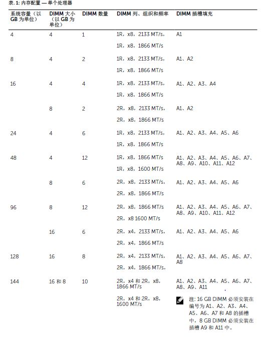
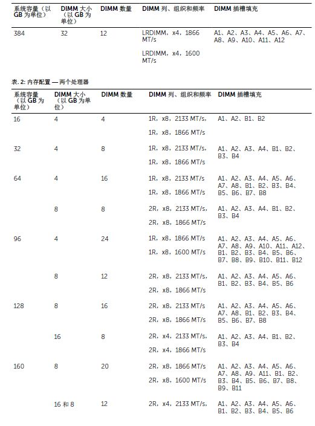
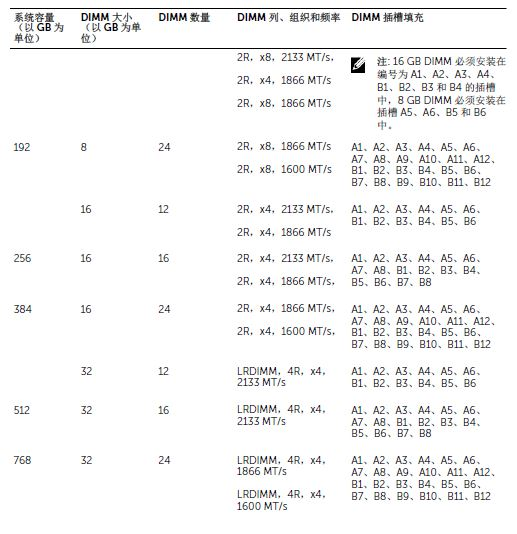

# DELL-R730内存插法

#### 一般内存模块安装原则此系统支持 Flexible Memory Configuration（灵活内存配置），使系统能够在任何有效芯片组结构配置中配置和运行。下面是建议的内存模块安装原则：
RDIMM 和 LRDIMM 不得混用。•基于 x4 和 x8 DRAM 的 DIMM 可以混用。每个通道最多可填充三个双列或单列 RDIMM。•无论列数
是多少，每个通道最多可以填充三个 LRDIMM。
内存配置示例下表显示遵循相应内存原则的一个和两个处理器配置的内存配置示例。
注: 下表中的 1R、2R 和 4R 分别表示单列、双列和四列 DIMM。

