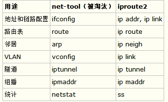

# ss命令

- 原理对比
```
ss比netstat快的主要原因是，netstat是遍历/proc下面每个PID目录，ss直接读/proc/net下面的统计信息。所以ss执行的时候消耗资源以及消耗的时间都比netstat少很多。
```

- 安装
```
yum install iproute -y
```

- 参数
```
ss（socket statistics）参数和使用

常用参数和netstat类似，如-anp
-a显示所有的sockets
-l显示正在监听的
-n显示数字IP和端口，不通过域名服务器
-p显示使用socket的对应的程序
-t只显示TCP sockets
-u只显示UDP sockets
-4 -6 只显示v4或v6V版本的sockets
-s打印出统计信息。这个选项不解析从各种源获得的socket。对于解析/proc/net/top大量的sockets计数时很有效
-0 显示PACKET sockets
-w 只显示RAW sockets
-x只显示UNIX域sockets
-r尝试进行域名解析，地址/端口
```


- netstat属于net-tools工具集，ss属于ipoute工具集。替换方案如下：

